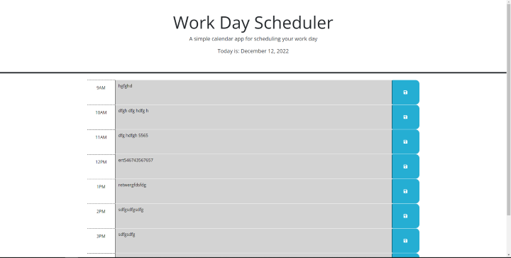

# Work-Day-Scheduler

## Description

In this challenge i built application that works as a daily scheduler. It displays the current date and  has time blocks change colors based on if its past present or future. all data entered into the time blocks can be saves wiht the save buttons and it saves to local storage. this application can be used for someone to schedule out their current work day.

## Screenshot

## Credit

Worked with a partner Marcus Paccapaniccia 
This is his github https://github.com/Mpacct/Daily-Schedule

## Link to Deployed Webpage and Repository

https://github.com/nickrosales/Work-Day-Scheduler
https://nickrosales.github.io/Work-Day-Scheduler/